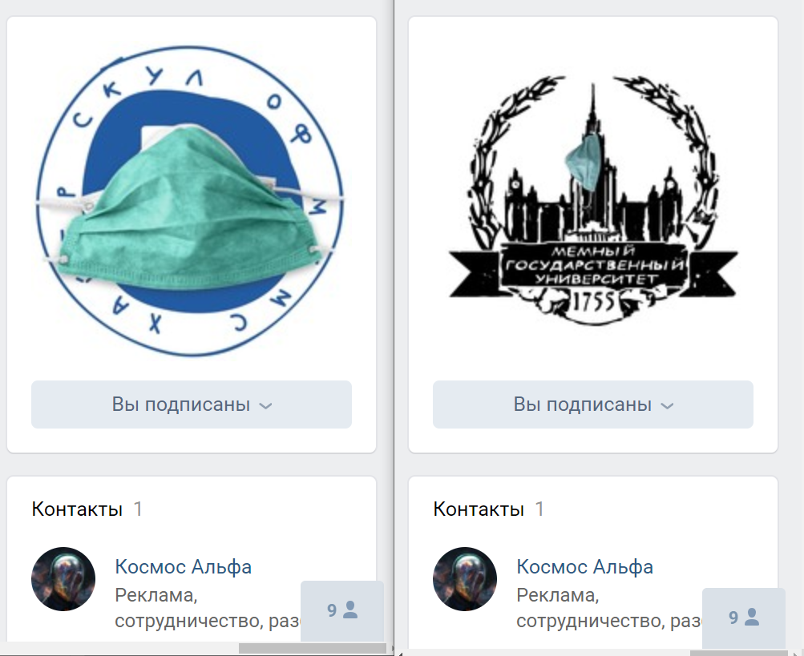

# Хакатон курса по dh 2019-2020

* разбейтесь на команды по 1-6 человек и придумайте ей название
* пройдите [по ссылке](https://classroom.github.com/a/WIdZYSpS), создайте свою команду и начните работать в созданном репозитории
* предлагаемый тайм-лайн хакатона:
    - 11:00--12:00 разбиение на команды, выбор проекта, обсуждение плана проекта, разделение обязанностей среди участников, создание репозитория проекта
    - 12:00--18:00 активная разработка проекта с перерывом на пиццу
    - 18:00--19:00 команда готовится к презентации результатов проекта
    - 19:00--20:00 все прекращают работать (к этому времени, и презентация, и все рабочие материалы группы должны быть в репозитории) и слушают презентации проектов
    - 20:00 -- комиссия говорит свои замечания, советы, идеи

Не стесняйтесь задавать вопросы менторам, если что-то не получается. Не стесняйтесь перемешивать языки: если что-то не получается в R, сделайте на Python, если так проще.

Кураторы по языка программирования:

|              |                 | R | Python |
|--------------|-----------------|---|--------|
| В. Поздняков | @pozdniakovivan | + | -      |
| Л. Чечик     | @tg_chechik     | + | -      |
| Г. Мороз     | @agricolamz     | + | -      |
| Ю. Мартысенко| @yulqui         | + | +      |
| Н. Хорошева  | @nstsj          | - | +      |
| О. Сериков   | @oserikov       | - | +      |
| Д. Скоринкин | @skorinkin      | - | +      |

## Задача 1 (Куратор: Ваня Поздняков, @pozdniakovivan)
Существует такой жанр текстов, как гороскопы. В данном задании предлагается проанализировать тексты гороскопов из самого популярного телеграм-канала с гороскопами --- @moygoroskop (телеграмм позволяет выкачать любой чат или канал в `.html`). Создайте датасет с переменными дата -- знак зодиака -- текст и проанализируйте его. Можно ли наблюдать какую-то цикличность в особенностях текстов предсказаний? Существуют ли какие-то особенности текстов предсказаний, связанные с каким-то знаком? Можно подумать и в другую сторону: попробовать сделать генератор предсказаний.

## Задача 2 (Куратор: Даня Скоринкин, @skorinkin)
Существует статья ["Палитра русской классики"](https://readymag.com/u94255285/colors-of-classics/) Л. Поповец, [проект цветолингвистика](http://oksanastogova.ru/lingvo_info.htm) О. Стоговой или недавний пост [ЦУН Библиотека им. Н.А. Некрасова](https://www.facebook.com/photo.php?id=428584113855873&set=pcb.3053258951388363&source=48). Попробуйте проанализировать цвета в корпусе фантастики.

## Задача 3 (Куратор: Гарик Мороз, @agricolamz)
[В какой-то момент на занятиях](https://agricolamz.github.io/DS_for_DH/%D0%BF%D1%80%D0%BE%D0%B2%D0%B5%D1%80%D0%BA%D0%B0-%D1%81%D1%82%D0%B0%D1%82%D0%B8%D1%81%D1%82%D0%B8%D1%87%D0%B5%D1%81%D0%BA%D0%B8%D1%85-%D0%B3%D0%B8%D0%BF%D0%BE%D1%82%D0%B5%D0%B7.html) мы обсуждали разницу энтропии между разными авторами. Посчитайте энтропию в корпусе фантастики и проанализируйте, что это мера может нам сказать о произведениях.

## Задача 4 (Куратор: Настя Хорошева, @nstsj)
Мы выкачали [датасет](https://www.kaggle.com/agricolamz/eating-dataset-from-edaru) с ингредиентами из разных рецептов в сайта eda.ru Проанализируйте данные и постройте граф связей ингредиентов. Также можно определить топ частотных рецептов, топ ингредиентов, топ сочетаний ингредиентов, построить дерево разновидностей рецептов по категориям (например, сколько видов салата "Цезарь" существует на сайте) или посмотреть, как кластеризуются рецепты на основе ингредиентов (кластеризация или уменьшение размерностей).

## Задача 5 (Куратор: Олег Сериков, @oserikov)

Есть т.н. мемы. И у Вышки и у МГУ есть вконтакте паблики с мемами (мы их [обкачали](https://drive.google.com/drive/folders/1Y64TbgASzM5TK8uY6UXTzaUDtZvs7A-N?usp=sharing)). Там почему-то указано одинаковое контактное лицо, это подозрительно...

* Возможно, никакие эти паблики не самобытные и там постят одинаковый контент?
* В какие моменты сообщества общаются друг с другом в комментах?
* О чем вообще шутят и мемируют в Вышке и МГУ?
* Есть т.н. мемы. Давайте срочно разбираться с компьютерным зрением! Мемы -- это же часто картинки, на которых что-то написано и что-то нарисовано.

Re: 💻👁️
Во-первых, точно где-то есть какие-то штуки, которые про фото говорят, что на нём за объекты: это api техногигантов ([ms](https://azure.microsoft.com/ru-ru/services/cognitive-services/computer-vision/#features), [google](https://cloud.google.com/vision), [amazon](https://aws.amazon.com/ru/rekognition/), [ibm](https://www.ibm.com/ru-ru/cloud/watson-visual-recognition)). Вы им отправляете фоточку, они в ответ -- что на фоточке.

Во-вторых, точно есть OCR. [`teserract`](https://ru.wikipedia.org/wiki/Tesseract) для R и питона и + ещё апи e.g. [яндекса](https://cloud.yandex.ru/docs/vision/concepts/ocr/) и ms (в том же [компзрении](https://azure.microsoft.com/ru-ru/services/cognitive-services/computer-vision/#features)) для русского и английского.

